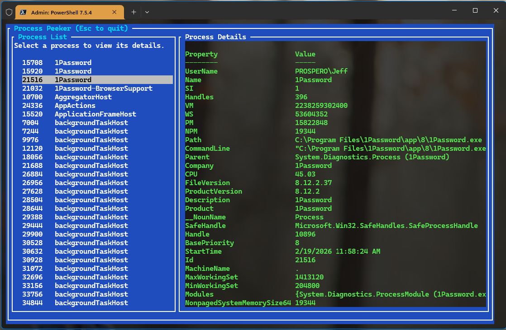

# PSTuiTools

This PowerShell 7 module contains a set of tools written using the open-source [Terminal.Gui](https://github.com/gui-cs/Terminal.Gui) toolkit. These types of commands are often referred to as a *tui* (terminal user interface).

These commands are designed to be run in the traditional PowerShell console and should run cross-platform, where the underlying PowerShell commands, e.g. `Get-Service`, is supported.

You are welcome to use the source code as reference material for your own projects.

Run `Get-PSTuiTools` to see a list of available commands.
