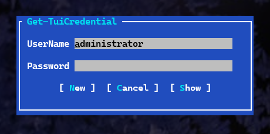
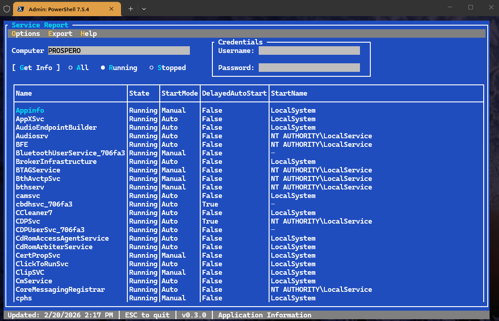
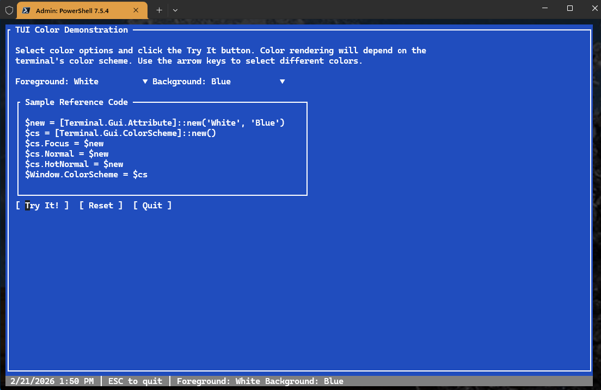
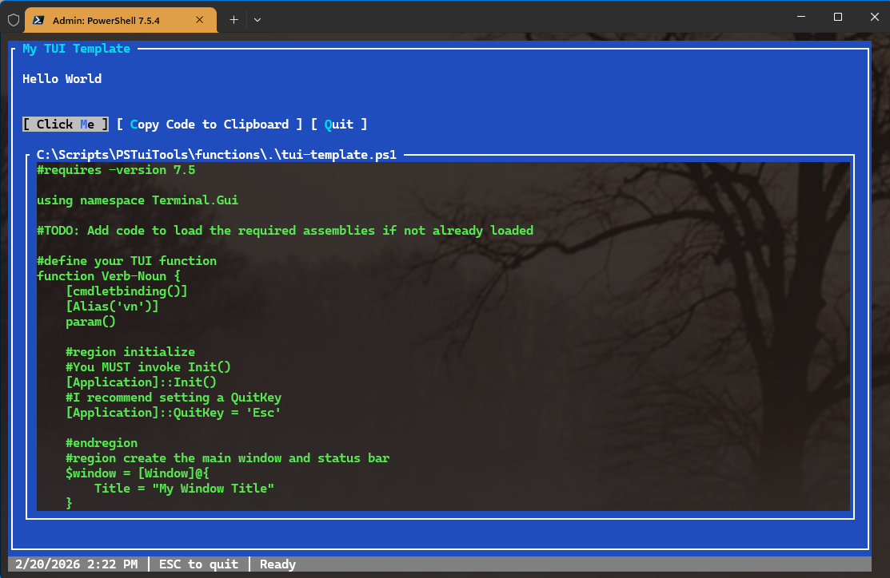

# PSTuiTools

[](https://www.powershellgallery.com/packages/PSTuiTools/) [](https://www.powershellgallery.com/packages/PSTuiTools/)

This PowerShell 7 module contains a set of tools and sample scripts written using the open-source [Terminal.Gui](https://github.com/gui-cs/Terminal.Gui) toolkit. These types of commands are often referred to as a *tui* (terminal user interface). These commands are designed to be run in the traditional PowerShell console and should run cross-platform, where the underlying PowerShell commands, e.g. `Get-Service`, are supported.

You are welcome and encouraged to use the source code as reference material for your projects. The sample TUIs are completely functional, but should not be considered production-ready. This module is intended as a reference framework and not something to implement in production.

## Installation

You can install the module from the PowerShell Gallery:

```powershell
Install-PSResource PSTuiTools
```

The module requires a PowerShell 7. Some of the TUI examples will work cross-platform. If there is a restriction, you will get a warning.

## Terminal.Gui

The samples in this module are built using version `1.19.0` of the open-source [Terminal.Gui](https://github.com/gui-cs/Terminal.Gui/tree/release/0.19). This has a dependency on the [NStack.Core](https://www.nuget.org/packages/NStack.Core/) package. Documentation for v1 can be found at [https://gui-cs.github.io/Terminal.GuiV1Docs/](https://gui-cs.github.io/Terminal.GuiV1Docs/).

This version was selected because it is the most recent stable release, although it is also the last release in the v1 branch.

> *The file version of the Terminal.Gui.dll will show `1.0.0.0` but the product version is `1.19.0`.*

### Terminal.Gui v2

Version 2 of Terminal.Gui is currently in development. The core features are supposedly set, but the current release is only at the alpha stage. I am hesitant to create TUI samples that might break with new pre-releases. There are significant changes in v2. When it is officially released, the plan is to update this module to use the latest stable version.

If you want to create TUIs using version 2, you can find reference documentation at [https://gui-cs.github.io/Terminal.Gui/](https://gui-cs.github.io/Terminal.Gui/). One feature I am looking forward to is removing the dependency on NStack.

### Potential Assembly Conflicts

There are other PowerShell modules you might have installed that also use Terminal.Gui. A prime example is the Microsoft.PowerShell.ConsoleGuiTools which provides the `Out-ConsoleGridView` command. This project uses v1.16.0 of the Terminal.Gui assembly. If this module is loaded first, you'll get a warning about the version conflict. I can't guarantee that all TUIs in this module will work as expected. If you load this module first, and then try to load Microsoft.PowerShell.ConsoleGuiTools, you'll get an error about the version conflict and the `Out-ConsoleGridView` command will not work.

Your best course of action is to choose one module or the other in your PowerShell session. This might require you to restart your PowerShell session.

This [module](PSTuiTools.psm1) includes code to attempt to mitigate assembly conflicts. I am open to PRs that provide a better solution.

## PSTuiTools

The module contains the following commands and features. The TUIs are __primarily intended__ as examples and reference material for you to use in your own projects. All commands include full help.

### [Get-PSTuiTools](docs\Get-PSTuiTools.md)

Run `Get-PSTuiTools` to see a list of available module commands including their aliases and help synopses.

```powershell
PS C:\> Get-PSTuiTools

   Module: PSTuiTools [v0.3.0]

Name                 Alias         Synopsis
----                 -----         --------
Get-PSTuiTools                     Get Sample TUI tools.
Get-TuiCredential                  Prompt for credentials in a TUI.
Invoke-ProcessPeeker ProcessPeeker A TUI process viewer.
Invoke-ServiceInfo   ServiceInfo   A TUI for displaying service information.
Invoke-SystemStatus  TuiStatus     Run a system status TUI monitor.
Invoke-TuiColorDemo  TuiColorDemo  Run the TUI color demo.
Invoke-TuiTemplate   TuiTemplate   Run the TUI template script.
Save-TuiAssembly                   Download Terminal.GUI and NStack assemblies.
```

### [Get-TuiCredential](docs\Get-TuiCredential.md)

This TUI will present a form to the user to enter a username and password. When the user clicks the submit button, a PSCredential object will be returned.

```powershell
$cred = Get-TuiCredential
```



You can pass a user name as a parameter value from the PowerShell prompt.

### [Invoke-ProcessPeeker](docs\Invoke-ProcessPeeker.md)

This is a sample TUI to display process information and details. Select a process from the list on the left to see details in the panel on the right.


### [Invoke-ServiceInfo](docs\Invoke-ServiceInfo.md)

This TUI will display service information from the specified computer. You can use alternate credentials to connect. You can also filter the services by status.



### [Invoke-SystemStatus](docs\Invoke-SystemStatus.md)

This is a very complex TUI that displays a variety of system information derived from `Get-CimInstance`.


### [Invoke-TuiColorDemo](docs\Invoke-TuiColorDemo.md)

You can use this TUI to experiment with different color combinations. The TUI will dynamically update sample code which you should be able to copy and paste into your project.



### [Invoke-TuiTemplate](docs\Invoke-TuiTemplate.md)

While you can manually open any file in this repository in your editor, I wanted to give you an easy way to jump start your TUI project. This command will open a demonstration TUI with a sample button. You can view the source code, or use the Copy button to copy the code to the clipboard. You can then paste the code into your project and modify it as needed.



### [Save-TuiAssembly](docs\Save-TuiAssembly.md)

Finally, you will need to include the Terminal.Gui and NStack assemblies in your project. You could copy the assembly files in this module, or run `Save-TuiAssembly` to download the latest versions of these assemblies to a local folder. You can then reference the assemblies in your project.

```powershell
Save-TuiAssembly -DestinationPath "C:\Tools\"
```

This will save both `Terminal.Gui.dll` and `NStack.Core.dll` to the specified folder. Your project will need to load the assemblies before you can use the Terminal.Gui namespace.

```powershell
Add-Type -path <path>\Nstack.dll
Add-Type -path <path>\Terminal.Gui.dll
```

Depending on your project, you may have other ways to load the assemblies.

## TUI Design

The TUIs were designed using Windows Terminal on Windows 11 running a 120x35 windows size. Layout might vary on non-Windows systems.

As you look through the code, you'll see that I am not consistent in how I write PowerShell to create the TUI. Some scripts use the `Terminal.Gui` namespace and others reference classes directly. You may also see code like this to define a TUI element:

```powershell
$lblUsername = [Terminal.Gui.Label] @{
    Text = 'UserName'
    X    = 1
    Y    = 1
}
```

Or like this:

```powershell
$lblUsername = [Terminal.Gui.Label]::new()
$lblUsername.Text = 'UserName'
$lblUsername.X = 1
$lblUsername.Y = 1
```

You can also use `New-Object`:

```powershell
$lblUsername = New-Object Terminal.Gui.Label
```

Although I don't think I am using this technique in my samples. I wanted to demonstrate different techniques, any of which are acceptable. Find one that makes the most sense to you and use it consistently in your code.

And one final word on color: How Terminal.Gui renders a color like `Green` will depend on the terminal's color scheme and possibly operating system.

## Notes

If you encounter a persistent bug with a TUI, you can file an Issue. Otherwise, feel free to use the Discussion section of this repository to ask questions or share your own TUI projects.
